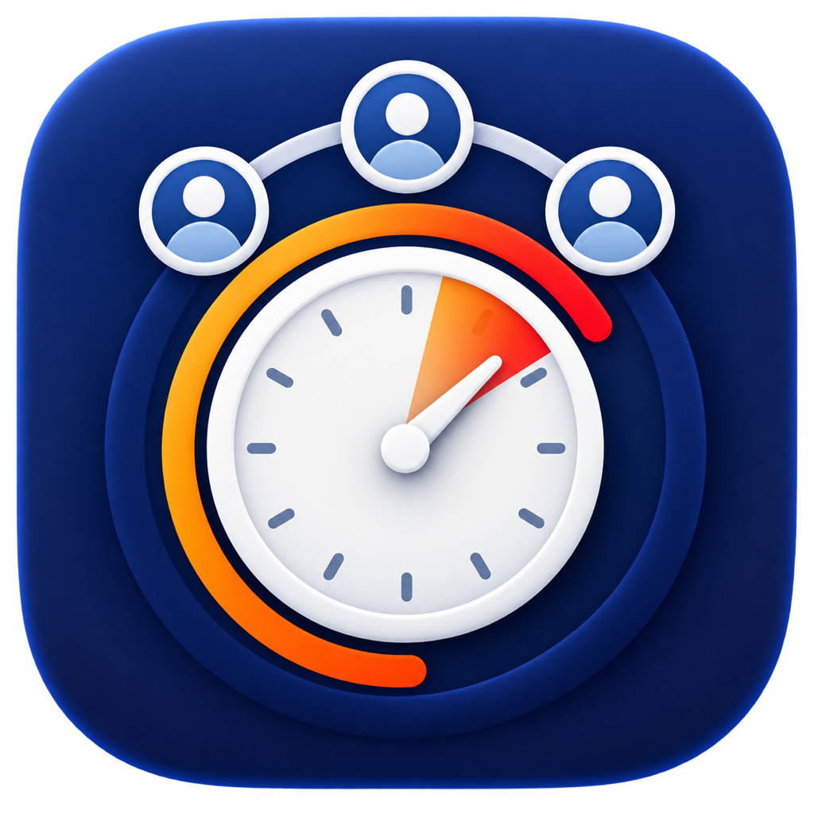
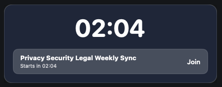
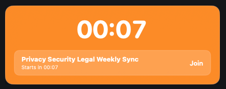
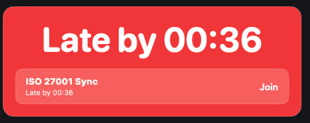
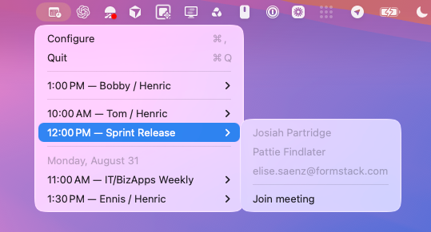
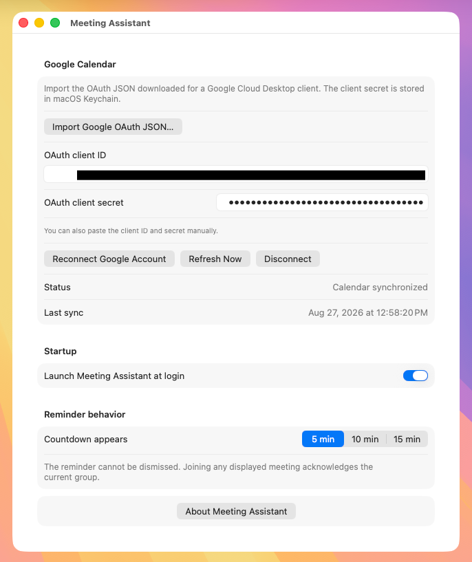

<div align="center">
  
  <h1>Meeting Assistant</h1>
  <p><strong>Because calendars are apparently too subtle.</strong></p>
</div>

Meeting Assistant is a native macOS 14+ menu-bar app that watches your primary Google Calendar and makes it exceptionally difficult to arrive late to a meeting. Before an accepted group meeting begins, it places a persistent countdown above your other windows on every display. The reminder cannot be dismissed: joining the meeting—or quitting the app after a deliberately inconvenient confirmation delay—is the way out.

## Why it exists

I kept arriving late to meetings. Google Calendar gave me a five-minute warning, Slack gave me a one-minute warning, and both vanished with the quiet confidence of notifications that believed their work was done. I also keep popup notifications turned off because I prefer doing my job without a small parade of rectangles appearing in the corner.

Meeting Assistant is the less nuanced response. It puts the countdown on screen and keeps it there until I join. It only cares about meetings with other people: if I am the sole participant, congratulations, I am already attending. Declined, tentative, and unaccepted invitations are ignored too. The app is persistent, not rude.

## How it works

Choose a 5, 10, or 15-minute lead time. The reminder starts calmly, turns orange and pulses during the final minute, then flashes red after the scheduled start. A newly discovered late meeting only opens a reminder during its first ten minutes.

<table>
  <tr>
    <td align="center"></td>
    <td align="center"></td>
    <td align="center"></td>
  </tr>
  <tr>
    <td align="center"><strong>Upcoming</strong><br>Persistent and visible.</td>
    <td align="center"><strong>Final minute</strong><br>Orange and pulsing.</td>
    <td align="center"><strong>Late</strong><br>Red, flashing, and unimpressed.</td>
  </tr>
</table>

The **Join** action opens the meeting URL and lets Google Meet, Zoom, or Microsoft Teams take over. If the invitation has no recognized conference URL, Meeting Assistant opens the Google Calendar event instead. Joining any displayed meeting acknowledges the current reminder group.

The menu-bar menu keeps up to five active or upcoming meetings close at hand. Meetings happening now remain listed until their scheduled end and are prefixed with `»`. Each meeting has a submenu containing the available participant names—never your own—and an always-available **Join meeting** action.

<p align="center">
  
</p>

Meeting Assistant refreshes the primary calendar every five minutes and after launch, wake, app activation, and network recovery. It handles recurring and rescheduled occurrences independently, and recognizes accepted group meetings even when Google omits a large guest list or returns only you and an external organizer.

Configure the Google connection, launch-at-login behavior, and countdown lead time from one window. Reconnecting and disconnecting require confirmation.

<p align="center">
  
</p>

### Meeting rules

Meeting Assistant includes accepted invitations and meetings you host when at least one other person is involved. It skips:

- Solo and room-only events
- Declined, tentative, and unaccepted invitations
- All-day and cancelled events
- Focus time, working location, and out-of-office entries

## Build

### Requirements

- macOS 14 or later
- Full Xcode with the macOS SDK installed
- A Google Cloud project with the Google Calendar API enabled

Run the tests and build the app bundle from the repository root:

```sh
DEVELOPER_DIR=/Applications/Xcode.app/Contents/Developer \
CLANG_MODULE_CACHE_PATH="$PWD/.build/cache/clang" \
SWIFTPM_MODULECACHE_OVERRIDE="$PWD/.build/cache/swiftpm" \
swift test --disable-sandbox

./scripts/build-app.sh
```

The build script creates `MeetingAssistant.app` in the repository root and ad-hoc signs it. It builds for the architecture of the Mac running the script.

### Project structure

- `Sources/MeetingAssistantCore` contains Calendar decoding and synchronization, meeting qualification, URL resolution, alert policy, OAuth, and persistence.
- `Sources/MeetingAssistant` contains the AppKit lifecycle, SwiftUI views, menu, configuration window, OAuth callback listener, and per-display reminder panels.
- `Tests/MeetingAssistantCoreTests` uses an injected clock and mocked networking; tests do not require live Google credentials.
- `Assets/AppIcon-1024.png` is the source application icon; `Packaging/AppIcon.icns` is bundled into the macOS app.

## Install and configure

The current build is ad-hoc signed rather than Developer ID-signed and notarized. It is appropriate for local use and testing, but a Mac receiving the app from someone else may show a Gatekeeper warning.

1. Quit any existing copy of Meeting Assistant.
2. Move `MeetingAssistant.app` into `/Applications`.
3. Open the app. If Gatekeeper blocks it, Control-click the app and choose **Open**, or approve it under **System Settings → Privacy & Security**.
4. If macOS requests it, allow Meeting Assistant under **System Settings → General → Login Items**.
5. Open the menu-bar icon and choose **Configure**.

### Connect Google Calendar

1. Create or select a project in [Google Cloud Console](https://console.cloud.google.com/).
2. Enable the **Google Calendar API**.
3. Configure the OAuth consent screen. For personal use, keep the app in Testing and add your Google account as a test user.
4. Create an OAuth client with application type **Desktop app**, then download its JSON credentials file.
5. In Meeting Assistant, click **Import Google OAuth JSON…** and select that file.
6. Click **Connect Google Account** and complete authorization in your browser.

Meeting Assistant requests only the read-only Calendar scope: `https://www.googleapis.com/auth/calendar.readonly`. The imported client secret and refresh credentials are stored in macOS Keychain. The credentials JSON is not copied into the repository or app bundle; calendar state and non-sensitive preferences are stored in the app's user defaults.
